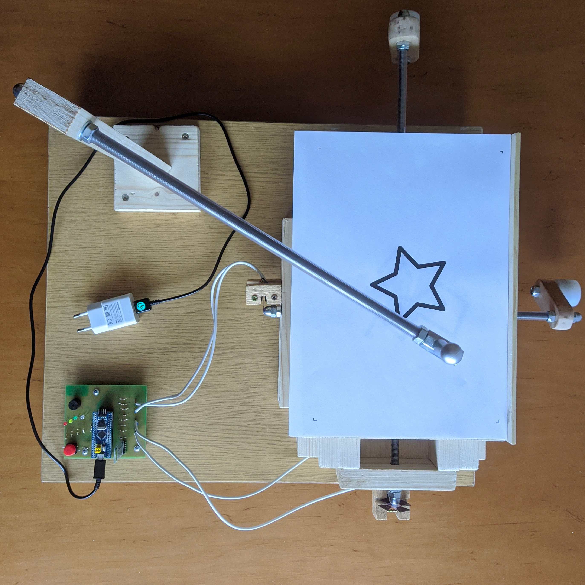
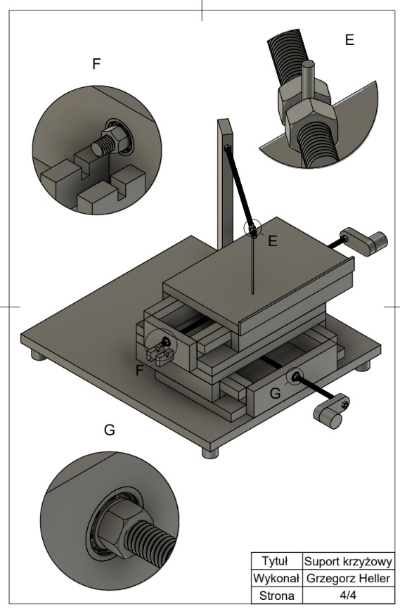
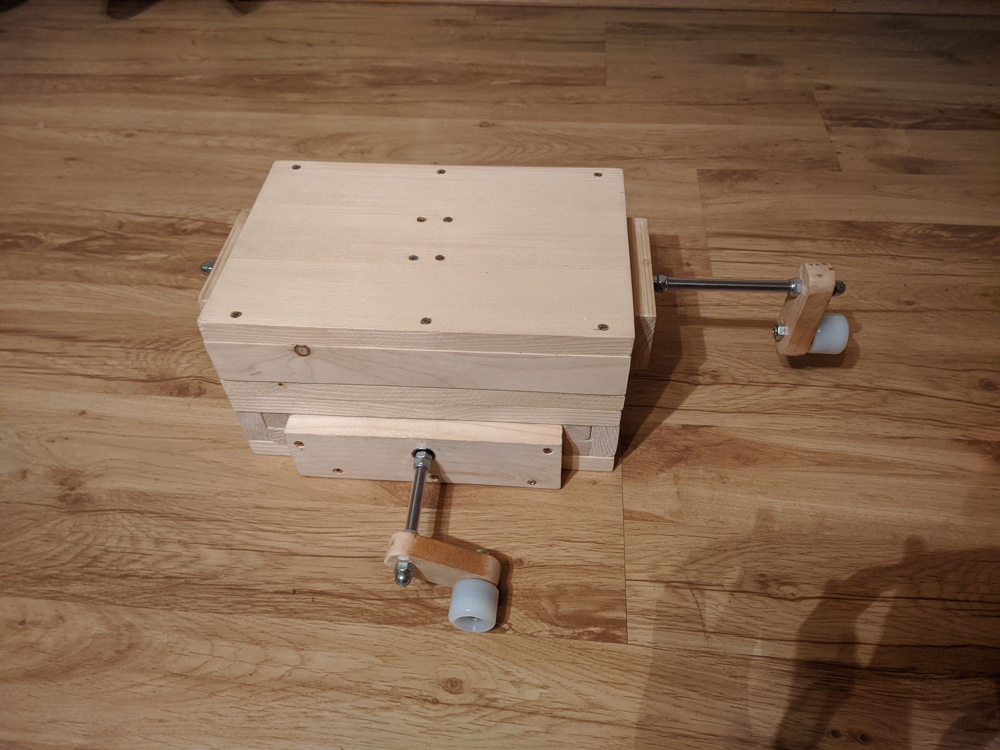
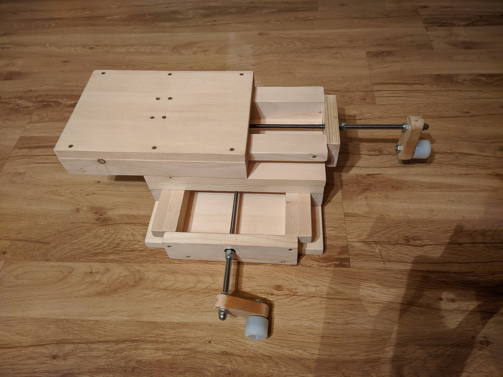
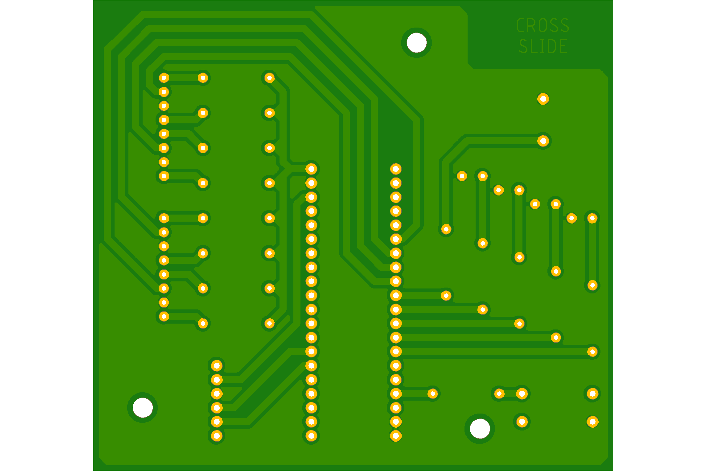
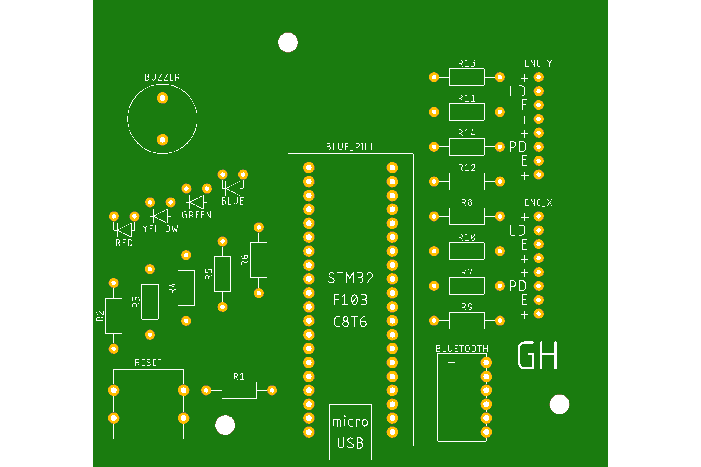
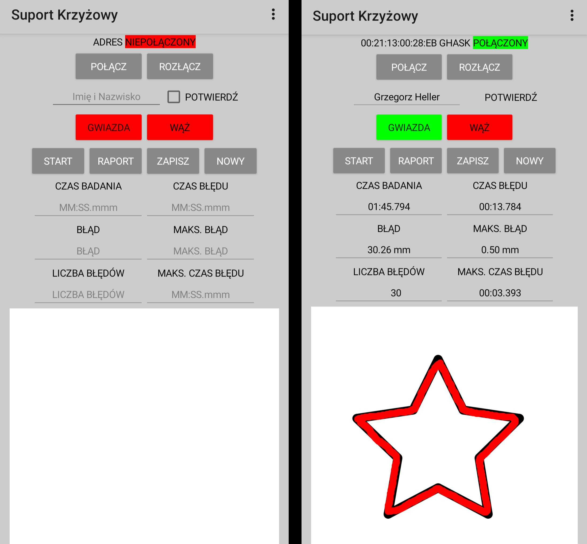
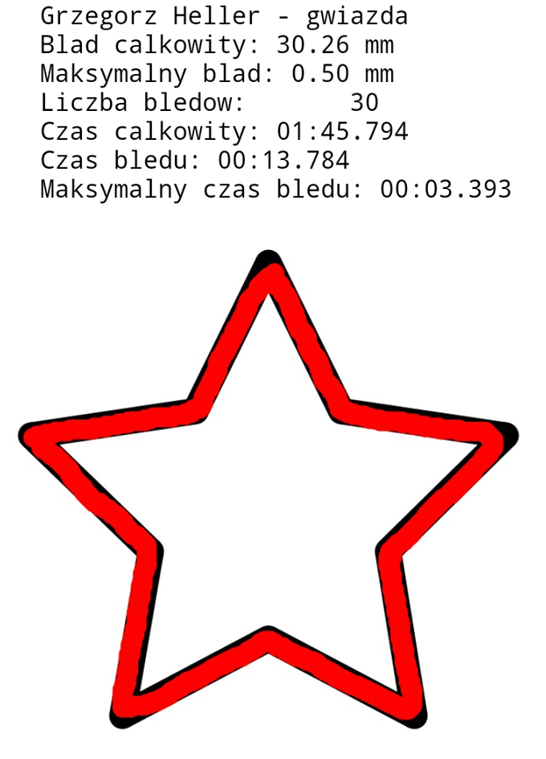

Author: Grzegorz Heller  
Date: 12.2020  

# Cross_Slide_Apparatus

 This is a preview of a prototype device used for eye-hand coordination tests. This project is part of my BSc thesis. 

 The examinee operates the device using two cranks. Each crank is responsible for moving the table in one axis, creating two degrees of freedom. The goal of the examinee is to get from start point to end point of a given trail (on this example the trail is a star) without straying away from the path (the stylus leaving the path counts as an error). 

  

  

  

  

  

  

  

  

